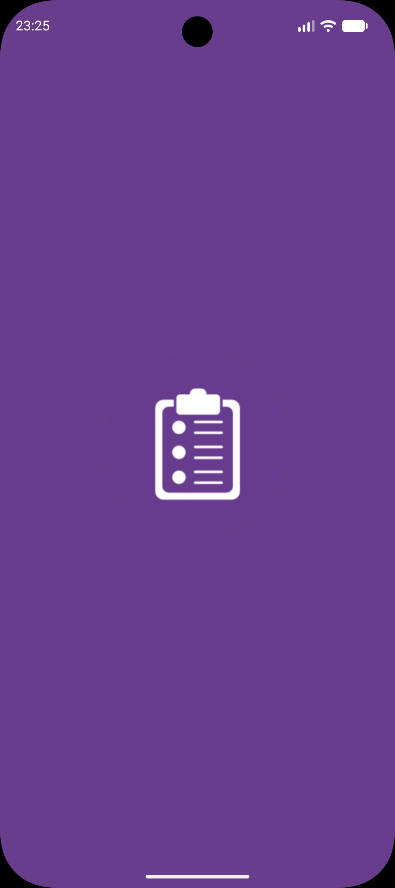
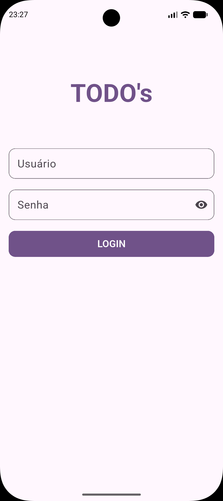
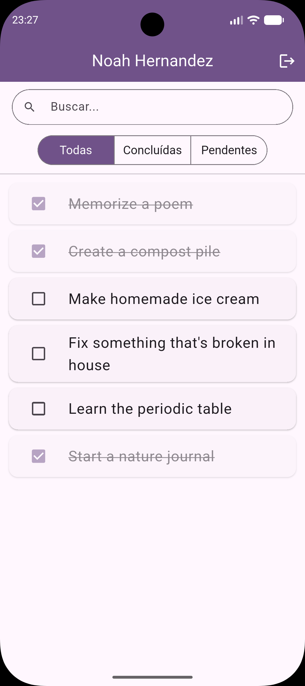

# TODO's - App de Autenticação e Tarefas

Um aplicativo desenvolvido em Flutter para autenticação de usuários e gerenciamento de tarefas (to-dos), consumindo a API pública [DummyJSON](https://dummyjson.com/). Este projeto foi construído seguindo uma arquitetura em camadas (**Datasource => Repository => Bloc => View**), com gerenciamento de estado via **BLoC**, injeção de dependência com **get_it**, e persistência híbrida (**SharedPreferences** para sessão do usuário e **SQLite** para as tarefas).

---
## 📸 Demonstração

| Tela 1: Splash | Tela 2: Login |
| :---: | :---: |
|  |  |

| Tela 3: Home (lista de tarefas) |
| :---: |
|  |

---
## 📱 Funcionalidades e Requisitos Implementados

### Camada de Dados e Arquitetura
* **Abstração de Client HTTP:** Camada `AppClient` desacoplada do Dio, com tradução de erros de rede (`DioException`) para exceptions próprias da aplicação (`AppClientException`).
* **Padrão Result:** Tratamento de erros sem exceptions "vazando" para as camadas de UI, cada Repository retorna um `Result<T>` (`Success`/`Failure`).
* **Injeção de Dependência:** Todas as dependências (Dio, Database, Datasources, Repositories, Blocs) são registradas e resolvidas via `get_it`.
* **Persistência Híbrida:**
  * `SharedPreferences` para manter a sessão do usuário logado.
  * `SQLite` (via `sqflite`) para persistir as tarefas localmente.

### Tela 1: Splash Screen
* Verificação automática, na inicialização do app, se existe um usuário salvo no `SharedPreferences`.
* Redirecionamento condicional: usuário logado => **Home** / não logado => **Login**.
* Splash nativa configurada com `flutter_native_splash`.

### Tela 2: Login
* Formulário com validação de campos obrigatórios (usuário e senha).
* Campo de senha com opção de mostrar/ocultar via ícone.
* Consumo do endpoint de autenticação da API, com tratamento de erro específico (ex: credenciais inválidas exibidas em `SnackBar`).
* Ao autenticar com sucesso, os dados do usuário são salvos no `SharedPreferences` e a navegação para a Home ocorre automaticamente.

### Tela 3: Home (Lista de Tarefas)
* **Carregamento de Dados:** Ao entrar na tela, busca as tarefas do usuário logado na API, salva no banco SQLite e exibe a partir de uma consulta local.
* **Filtros Combináveis:**
  * Por status: Todas / Pendentes / Concluídas.
  * Por texto: busca reativa pelo conteúdo da tarefa.
* **Interação com Tarefas:**
  * Checkbox em cada card para marcar/desmarcar a tarefa como concluída, refletindo a alteração imediatamente no banco de dados e na tela.
* **Logout:** Botão na `AppBar` para encerrar a sessão, limpando os dados salvos e retornando à tela de Login.

---

## 🚀 Como executar

### Pré-requisitos

- [Flutter SDK](https://docs.flutter.dev/get-started/install) instalado (versão 3.44.4 ou superior)
- Um emulador Android configurado, ou dispositivo físico conectado

### Passos

```bash
# Clone o repositório
git clone https://github.com/cicerobas/mini_projeto_m02.git

# Entre na pasta do projeto
cd mini_projeto_m02/

# Instale as dependências
flutter pub get

# Rode o projeto
flutter run
```

### Credenciais de teste

A API [DummyJSON](https://dummyjson.com/docs/auth) disponibiliza usuários fictícios para teste, por exemplo:

```
usuário: emilys
senha: emilyspass
```

---

## Melhorias Futuras

* Adicionar testes unitários.
* Suporte a criação de novas tarefas diretamente pelo app.
* Tema escuro (dark mode).